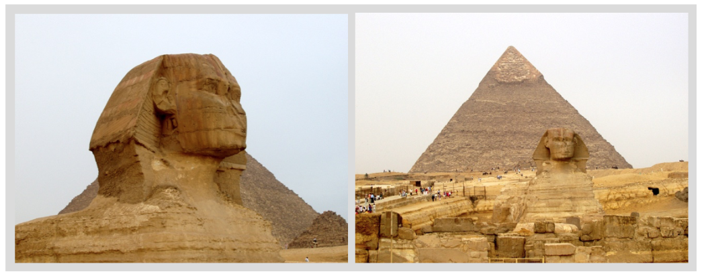

# Color-Composition-Similarity

<br>

This repository contains the dataset for Color Composition Similarity. 

Color Composition Similarity is measured by human judgement on the scale from 1 to 5 where 1 is the least similar and 5 is the most similar for a pair of images. The color similarity is evaluated independent of the content (object/image classes) as much as possible.

<br>

**The similarity in color composition of an evaluated image to its reference image can be rated as:**

* **1. Very different:** neither the image colors, nor their layouts is similar at all.
* **2. Substantially different:** less than 50% of the colors are similar, and their layouts are a bit similar.
* **3. Fairly similar:** about 50% of the colors are similar and their layouts are similar.
* **4. Substantially similar:** more than 50% of the colors are similar and their layouts are similar.
* **5. Very similar:** image colors and their layouts are mostly the same.

<br>

**The participants were asked to evaluate the color composition similarity based on these criteria:**
* Overal layout and distribution of colors.
* Dominant colors between two images.
* Comparing colors of foreground and background between the pair of images.
* Compare tone of images (for example, two images can be highly similar because both have "autumn" colors)

<br>

## Download:

The image dataset and annotations can be download [here](https://osf.io/gteub/).

<br>

## Citation:

If you use our dataset, please cite our paper:

```
@inproceedings{ha2020_color_sim,
title={Color Composition Similarity and Its Application in Fine-grained Similarity},
author={Ha, Mai Lan and Hosu, Vlad and Blanz, Volker},
booktitle={IEEE Winter Conf. on Applications of Computer Vision (WACV)},
year={2020},
}
```

<br>

## Example of rating score 5 versus rating score 3:


  Score 5    |   Score 3
------------ | -------------
 | 
even though image A and the reference image contain different objects, they are very similar in terms of color composition: white object in the middle of a dark background. | even though image B and the reference image both contain a white duck, the background colors are very different. Each duck covers about 50% of the image, therefore around 50% of the colors are similar.

<br>

## Examples of rating score 5:

Pairs of images that are close to identical in terms of colors and their layout.

<p align="center">
  
  
  
</p>

<br>

## Examples of rating score 4:

Pairs of images that have similar layouts. The colors are not identical but more than 50% similar.

<p align="center">
  
  
</p>

<br>

## Examples of rating score 3:

Pairs of images of which about 50% of the colors and layouts are similar.

<p align="center">
  
  
  
</p>

<br>

## Examples of rating score 2:

Pairs of images that have some color similarities, but less than 50%.

<p align="center">
  
  
</p>

<br>

## Examples of rating score 1:

Pairs of images that have no similarity in term of color composition.

<p align="center">
  
  
  
</p>


